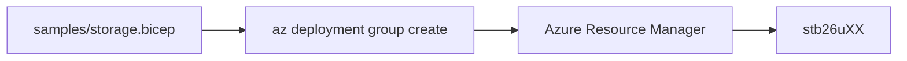

# Day 1 — Azure Bicep fundamentals

Commands: [commands.md](commands.md)  
Labs: `samples/storage.bicep` and `samples/storage.bicepparam` (replace `XX`). `location` keeps its default in the `.bicep` file.

---

## Module 1.1 — IaC and Bicep basics

### Infrastructure as Code

Infrastructure as Code means the **file** is the source of truth. You describe a storage account in Bicep and apply that file. A portal click path is not what you replay tomorrow.

The same file, applied twice, still describes the **same** account (`stb26uXX` in `rg-bicep-uXX`). If Azure already matches the file, ARM reports Succeeded without inventing a second name.



### Why Bicep over ARM templates

Azure Resource Manager does not execute Bicep. The Bicep CLI **compiles** `.bicep` to ARM JSON, then ARM applies the JSON. Same resource types (`Microsoft.Storage/storageAccounts`) and same API versions (`2023-05-01`). You author Bicep because the JSON is verbose.

| You write | ARM receives |
|-----------|----------------|
| `resource stg 'Microsoft.Storage/storageAccounts@2023-05-01'` | `"type": "Microsoft.Storage/storageAccounts", "apiVersion": "2023-05-01"` |
| `sku: { name: 'Standard_LRS' }` | nested `"sku": { "name": "Standard_LRS" }` |
| symbolic name `stg` | a resource entry in the JSON `resources` array |

```bash
az bicep build --file day-01/samples/storage.bicep
```

Compare line counts of `.bicep` vs the generated `.json`. The JSON is compiler output (not committed). You do not author or paste ARM JSON in this course.

### Declarative deployment model

**Declarative:** the file states the desired name and SKU. You do not write “create, then if it exists update.”

**Imperative** (not this course): a script of `az storage account create` / `update` with your own if/else.

Give a driver a destination, not turn-by-turn steps. You name the storage account and SKU; ARM chooses the API calls. If the account already exists with that SKU, the next deploy still **Succeeded**.

ARM compares the template to the resource group and **converges**. Lab 1 deploys, changes SKU, deploys again, then deploys with **no** file change. That last run is still Succeeded. `az deployment group what-if` can print the delta before apply; that is a **lab on Day 5**, not today.

Hands-on: Lab 1 first deploy, SKU change, then the second deploy with no edits.

### Azure Resource Manager basics

ARM is the Azure **control plane**. Portal, CLI, and Bicep all call ARM to create, update, or delete resources. Bicep is not a second control plane. The **data plane** is using the resource after it exists (upload a blob, query a database). This course deploys through the control plane.

Bicep does **not** keep a state file. Each deploy asks ARM what is in the resource group **now** and compares that to the template.

This course uses **incremental** mode (the CLI default). ARM adds or updates resources named in the file. It does not delete other resources that already sit in the same resource group.

A deployment is a **record** in the resource group (`az deployment group list`). The storage account is the **resource**. Both exist after Lab 1. The deployment name for `az deployment group create --template-file day-01/samples/storage.bicep` defaults from the file name (`storage`).

### Bicep file structure

Today’s file has `param`, `resource`, and `output`. No modules yet (Day 2). From `day-01/samples/storage.bicep`:

```bicep
param location string = resourceGroup().location
param storageAccountName string

param tags object = {
  env: 'dev'
  owner: 'uXX'
  project: 'bicep-training'
}

resource stg 'Microsoft.Storage/storageAccounts@2023-05-01' = {
  name: storageAccountName
  location: location
  sku: { name: 'Standard_LRS' }
  kind: 'StorageV2'
  tags: tags
  properties: {
    accessTier: 'Hot'
    minimumTlsVersion: 'TLS1_2'
    supportsHttpsTrafficOnly: true
    allowBlobPublicAccess: false
    defaultToOAuthAuthentication: true
  }
}

output storageName string = stg.name
output httpsOnly bool = stg.properties.supportsHttpsTrafficOnly
output minimumTls string = stg.properties.minimumTlsVersion
```

| Piece | Role |
|-------|------|
| `param` | Input (`storageAccountName` comes from `samples/storage.bicepparam`) |
| `resource stg` | Symbolic name `stg`; Azure name is `storageAccountName` |
| `output` | Values you read after deploy (`az deployment group show --query properties.outputs`) |

HTTPS, TLS 1.2, and no anonymous blobs are properties of the **same** storage account — not extra products. `env` / `owner` / `project` tags are on the resource so the resource group policy allows the create (you study that on Day 6). Set `owner` to your id (`u03`, not the letters `uXX`).

### Resource declaration syntax

The type string is `Microsoft.<Provider>/<type>@<api-version>`. Symbolic name ≠ Azure name: `stg` is only in Bicep; `stb26uXX` is what Azure stores.

| Piece | Role |
|-------|------|
| `resource` | Keyword: this block is an Azure resource |
| `stg` | Symbolic name — only inside this file (`stg.name`, `stg.properties…`) |
| `Microsoft.Storage/storageAccounts@2023-05-01` | Resource provider, type, and REST API version |
| `{ name, location, sku, … }` | Payload ARM sends for that API version |

After deploy, query the live properties the template set:

```bash
az storage account show -g rg-bicep-uXX -n stb26uXX --query "{tls:minimumTlsVersion, https:enableHttpsTrafficOnly}"
```

### Idempotent deployments

A second deploy with the **same** name and SKU is **Succeeded**. ARM did not necessarily create a second account. Do not treat Succeeded as “it created another one.”

A SKU change (`Standard_LRS` → `Standard_GRS`) is still the **same** account; ARM updates it. Cleanup deletes that account and **keeps** `rg-bicep-uXX` for the rest of the week.

---

## Lab 1 — Core Bicep workflow

Goal: write and deploy a basic template safely.

| Step | What you do |
|------|-------------|
| Create RG | `az group create --name rg-bicep-uXX --location eastus` |
| File | `samples/storage.bicep` + `samples/storage.bicepparam` → account `stb26uXX` |
| Deploy | `az deployment group create --template-file … --parameters day-01/samples/storage.bicepparam` |
| Change SKU | `Standard_LRS` → `Standard_GRS`, deploy again |
| Idempotent | deploy again with no file change |
| Cleanup | delete the storage account; **keep** the resource group; set SKU back to `Standard_LRS` |

Commands: [commands.md](commands.md) — Lab 1.

---

## Module 1.2 — Tooling and validation

### Azure CLI

`az login` as `buXX@attt21.onmicrosoft.com`, `az account show` (name **MSDN**), `az group create`, `az deployment group create`. Bash on Cloud Shell or Git Bash. Confirm the subscription **name** before any deploy.

### Bicep CLI

| Command | What it does |
|---------|----------------|
| `az bicep version` / `az bicep install` | Tooling |
| `az bicep build` | Compile to ARM JSON (what ARM will see) |
| `az bicep lint` | Analyzer warnings/errors |
| `az bicep format` | Rewrite layout; does not change meaning |

Build compiles to ARM JSON; you still author Bicep.

### VS Code Bicep extension

Install `ms-azuretools.vscode-bicep` for squiggles and the command palette. The extension checks the file against the API version schema: if `location` is missing, the symbolic name is flagged **before** you call ARM. Cloud Shell is enough if you have no VS Code.

### Linting and formatting

`az bicep format` rewrites layout. `az bicep lint` reports problems. Unused parameters are warnings. A `@secure()` parameter with a non-empty default is an **error** (`secure-parameter-default`).

---

## Lab 2 — Validation and errors

Break `location: location` into `location location`, run `build` and `lint`, restore the colon, format, build, deploy `stb26uXX` again. The compiler fails on the broken file; ARM is not called until `az deployment group create` after the fix.

Commands: [commands.md](commands.md) — Lab 2.

What-If is a **lab on Day 5**. No Azure DevOps today.
