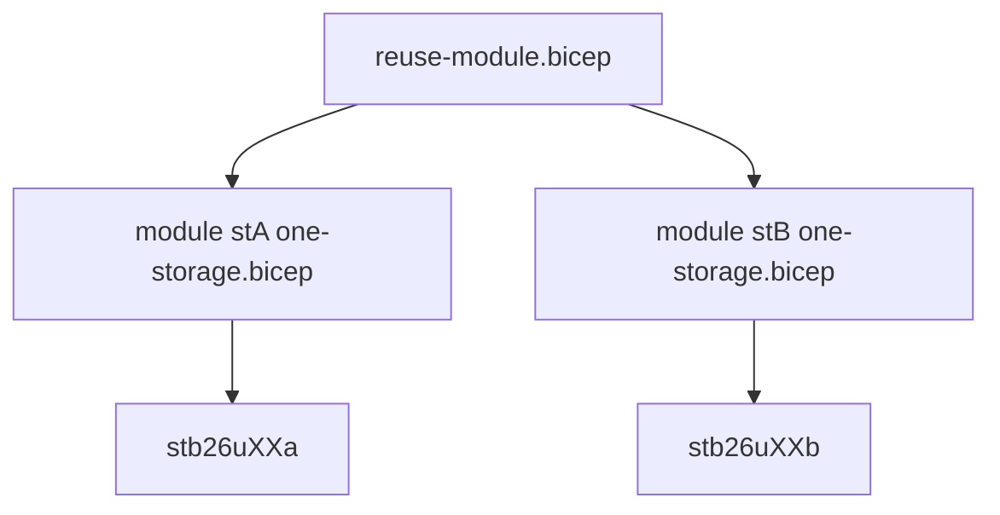

# Day 2 — Parameters, variables, and modules

Commands: [commands.md](commands.md)  
Labs: `samples/env-template.bicep` (dev/test param files) and `samples/reuse-module.bicep` (module twice). Replace `XX`.

---

## Module 2.1 — Parameters and validation

### Parameters and data types

Day 1 SKU lived as a string **inside** the resource. Today values are `param`s at the top of `samples/env-template.bicep`:

| Param | Type | Today |
|-------|------|--------|
| `namePrefix` | string | `stb26uXX` (becomes `…a` and `…b`) |
| `storageSku` | string | `Standard_LRS` or `Standard_GRS` |
| `location` | string | defaults to `resourceGroup().location` |
| `tags` | object | `env`, `owner`, `project` |
| `deployCompute` | bool | **false** today |

`adminPassword` is `@secure()` for Day 3. Do not put a password in a param file. Do not `output` a `@secure()` value: outputs are stored in deployment history in plain text.

### Default values

A default is used when the caller omits the value. `storageSku` defaults to `Standard_LRS` in `samples/env-template.bicep`. The **dev** param file sets LRS; the **test** file sets GRS.

A value in `.bicepparam` overrides the default. A `--parameters storageSku=…` on the CLI overrides the file.

### Allowed values

```bicep
@allowed([
  'Standard_LRS'
  'Standard_GRS'
])
param storageSku string = 'Standard_LRS'
```

`Premium_LRS` is outside the list. The deploy **fails validation** before ARM creates a Premium account. That is error prevention, not a SKU product lesson.

Hands-on: Lab 1 — Input validation (`storageSku=Premium_LRS`).

### Input validation

Storage account names are 3–24 lowercase letters and numbers, globally unique. This course uses `namePrefix` + `a` / `b`.

```bicep
@minLength(3)
@maxLength(11)
param namePrefix string
```

`@maxLength(11)` keeps `prefix + a` and `prefix + b` within 24 characters (`stb26u01` is 8; `stb26u01a` is 9).

### Parameter files

`.bicepparam` starts with `using '../main.bicep'`. The compiler checks names and types against that template. This course does **not** use JSON parameter files. `@description` on a `param` in `main.bicep` is documentation the compiler and the editor can show; it is not a second source of values.

Dev vs test is **two files, one template**:

| File | SKU | `env` tag |
|------|-----|-----------|
| `dev.bicepparam` | `Standard_LRS` | `dev` |
| `test.bicepparam` | `Standard_GRS` | `test` |
| `defaults.bicepparam` | omitted → `Standard_LRS` | `dev` |

Same `namePrefix` in all three. Same two Azure names (`stb26uXXa` / `b`). Different SKU or tags — not a second pair of accounts.

---

## Lab 1 — Environment-ready template

Compare `day-01/samples/storage.bicep` (SKU inside the resource) with `day-02/samples/env-template.bicep` (parameters). Deploy **dev**, then try `Premium_LRS` (fails `@allowed`) and deploy **test**.

Commands: [commands.md](commands.md) — Lab 1.

---

## Module 2.2 — Variables, outputs, and modules

### Variables

```bicep
var storageNameA = '${namePrefix}a'
var storageNameB = '${namePrefix}b'
```

A `var` is computed in the template. It is not an input. Naming lives in one place. String interpolation (`'${namePrefix}a'`) is the Bicep form of concatenation.

A `var` can also choose a value with a ternary (`condition ? ifTrue : ifFalse`). Example: `var storageSku = (environmentType == 'prod') ? 'Standard_GRS' : 'Standard_LRS'`. This course still sets SKU from **dev** and **test** parameter files (`Standard_LRS` vs `Standard_GRS`), not from that pattern.

### Naming conventions

Accounts are `stb26uXXa` and `stb26uXXb`. Globally unique, lowercase alphanumeric, 3–24 characters. Do not invent a third required name for this week.

### Outputs

The storage module outputs `name`, `id`, and `sku`. `reuse-module.bicep` re-exports both names and the SKU. Read them after deploy:

```bash
az deployment group show --resource-group rg-bicep-uXX --name reuse-module --query properties.outputs
```

The `name:` on a module (`storageA`, `storageB`) is the **nested deployment** name in ARM (`Microsoft.Resources/deployments`). After Lab 2, `az deployment group list` shows `reuse-module`, `storageA`, and `storageB`.

### Module structure and local modules

A module is another `.bicep` file invoked with `module`. Path `'modules/one-storage.bicep'` is **local** (files in this repo). Invoked **twice** (`stA`, `stB`) with different `storageAccountName` values. Same SKU and tags.

The `name:` on a module (`storageA`, `storageB`) is the **nested deployment** name in ARM (`Microsoft.Resources/deployments`). After Lab 2, `az deployment group list` shows `reuse-module`, `storageA`, and `storageB`. `stA` and `stB` do not wait on each other; both accounts can deploy in parallel. If a later module read `stA.outputs.id`, Bicep would wait for `stA`.



No Bicep registry. No Template Specs. `stA` and `stB` are symbolic names of **module instances**, not Azure names.

The storage module also sets TLS 1.2, HTTPS-only, and `allowBlobPublicAccess: false` — same account type as Day 1, now reused.

---

## Lab 2 — Modular deployment

Read `samples/modules/one-storage.bicep`. Deploy `reuse-module.bicepparam` so **both** accounts are `Standard_GRS`. Confirm with `az storage account list` and the deployment outputs.

Commands: [commands.md](commands.md) — Lab 2.

No VNet, VM, pipeline, or What-If lab today.
