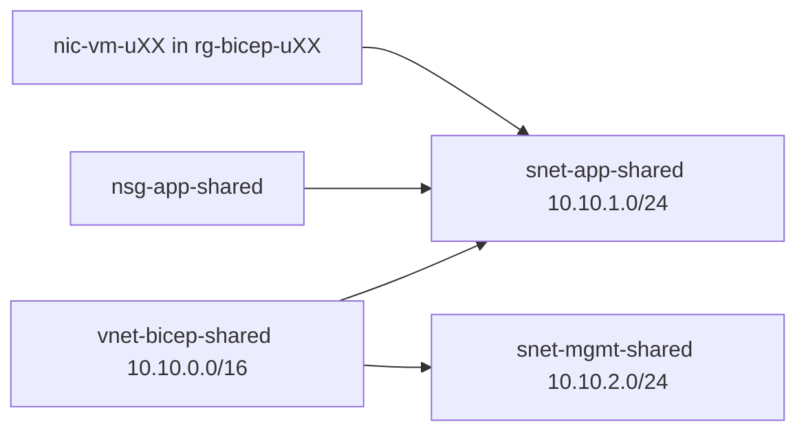

# Day 3 — Network and compute

Commands: [commands.md](commands.md)  
Labs: `samples/network.bicep` in **your** RG. Lab 2 VM uses the **class** VNet (`samples/existing-vnet.bicep` + `samples/compute.bicep`).

Do not deploy into `rg-bicep-shared`. Pass `adminPassword` on the command line only — same `--parameters` line as `compute.bicepparam`, not a second `--parameters` flag.

---

## Module 3.1 — Networking with Bicep

### VNet design basics

One class virtual network in `rg-bicep-shared`. Address space `10.10.0.0/16`. Student NICs attach to the **app** subnet. You do **not** each create a VNet. A second VNet per student would collide on names and on the shared resource group.



| Object | Resource group | Who deploys |
|--------|----------------|-------------|
| VNet, subnets, NSG | `rg-bicep-shared` | Already deployed |
| NIC, PIP, VM, storage | `rg-bicep-uXX` | You (Lab 2) |

### Subnets

| Subnet | Prefix | NSG | Lab VM |
|--------|--------|-----|--------|
| `snet-app-shared` | `10.10.1.0/24` | `nsg-app-shared` | Yes |
| `snet-mgmt-shared` | `10.10.2.0/24` | none | No |

The mgmt subnet exists so the `for` loop has **two** items (light loop). Do not put the VM on mgmt today.

This class declares subnets **inline** on the VNet (`properties.subnets` plus `for`). Azure also allows a **child** subnet resource (`Microsoft.Network/virtualNetworks/subnets` with `parent: vnet`). Same Azure objects. The class file uses the inline form.

### NSG overview

`nsg-app-shared` is associated with the **app** subnet only. Rules are a second light `for` loop:

| Rule | Priority | Access | Port |
|------|----------|--------|------|
| AllowSSH | 1000 | Allow | 22 |
| DenyRDP | 4096 | Deny | 3389 |

Source `*` on SSH is a classroom shortcut, not production. Both rules are TCP inbound.

```bicep
var nsgRules = [
  { name: 'AllowSSH' priority: 1000 access: 'Allow' destinationPortRange: '22' }
  { name: 'DenyRDP'  priority: 4096 access: 'Deny'  destinationPortRange: '3389' }
]
securityRules: [for r in nsgRules: { name: r.name properties: { ... } }]
```

### Dependencies

Subnet property `networkSecurityGroup.id: nsg.id` creates the dependency. Symbolic names; no extra `dependsOn`. The VNet resource uses `union` so only the app subnet gets the NSG id:

```bicep
subnets: [for s in subnets: {
  name: s.name
  properties: union({ addressPrefix: s.addressPrefix }, s.attachNsg ? { networkSecurityGroup: { id: nsg.id } } : {})
}]
```

Two `for` loops, both light: two subnets, two NSG rules. No `range()`, no nested loops.

---

## Lab 1 — Network foundation

Deploy `samples/network.bicep` into `rg-bicep-uXX` (`vnet-bicep-uXX`, two subnets, NSG on the app subnet). Confirm with `az network vnet show`, subnet list, and NSG association. Do not deploy this file into `rg-bicep-shared`.

Commands: [commands.md](commands.md) — Lab 1.

---

## Module 3.2 — Compute and secure patterns

### VM components

The compute module creates four Azure objects that together are “the VM”:

| Resource | Name |
|----------|------|
| Virtual machine | `vm-bicep-uXX` |
| OS disk | `${vmName}-osdisk` (`Standard_LRS`) |
| NIC | `nic-vm-uXX` |
| Public IP | `pip-vm-uXX` (Standard, static) |

Image: Ubuntu 22.04 (`22_04-lts-gen2`). Size: `Standard_B1s` (allowed: `Standard_B2s`). Boot diagnostics go to the **blob endpoint** of storage account `a` in the same RG (`stA.outputs.blobEndpoint` in `main.bicep`). Password auth stays on (`disablePasswordAuthentication: false`) because this lab passes `--parameters adminPassword=`.

Bicep orders these without a `dependsOn` list: the NIC uses `appSubnet.id`, the VM uses `nic.id`. ARM waits because of those references.

### NICs and disks

The NIC lives in **your** RG. Its subnet **id** is the class app subnet (`…/rg-bicep-shared/…/snet-app-shared`). That is how compute in `rg-bicep-uXX` sits on the shared network without owning the VNet.

### Admin credentials

Username `azureuser`. Password is `@secure()` in Bicep. `compute.bicepparam` declares `param adminPassword = ''` as a placeholder so the CLI can accept an inline override. The real password goes on the **same** `--parameters` line as the param file:

```bash
--parameters day-03/samples/compute.bicepparam adminPassword='<admin-password>'
```

Do not put the password in `compute.bicepparam`. After Lab 2, `az deployment group show` masks the password in deployment history.

### Secret handling risks

A password in shell history, chat, or a committed param file is a leak. `grep adminPassword day-03/samples/compute.bicepparam` should show only `param adminPassword = ''`. Do not `git add` a password.

### Key Vault integration pattern (theory only)

Production: store the secret in Azure Key Vault; Bicep can use `getSecret` or a Key Vault reference at deploy time. This course does **not** create a vault and does not open the Key Vault create blade.

### `existing`

```bicep
resource sharedVnet 'Microsoft.Network/virtualNetworks@2023-09-01' existing = if (deployCompute) {
  name: sharedVnetName
  scope: resourceGroup(sharedNetworkRg)
}

resource sharedAppSubnet 'Microsoft.Network/virtualNetworks/subnets@2023-09-01' existing = if (deployCompute) {
  parent: sharedVnet
  name: sharedAppSubnetName
}
```

`existing` is a **lookup**. It does not create or update the VNet. `scope: resourceGroup('rg-bicep-shared')` is how a template in `rg-bicep-uXX` reads a resource in another group. The VM is still created in `rg-bicep-uXX`.

---

## Lab 2 — Compute on existing network

`samples/existing-vnet.bicep` looks up the class VNet. `samples/compute.bicep` deploys `vm-bicep-uXX` / `nic-vm-uXX` / `pip-vm-uXX` onto `snet-app-shared`. Password on the CLI. Validate with `az vm show`, NIC subnet id, public IP, and the masked `adminPassword` on the deployment.

If B-series quota is gone, skip the VM; Lab 1 VNet and the class VNet still count.

Commands: [commands.md](commands.md) — Lab 2.

No pipelines today.

Optional later: [extras/deployment-stacks.md](extras/deployment-stacks.md) — deploy the same kind of VM with a deployment stack, then detach or delete the set. Not part of the main labs.
