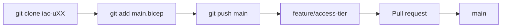

# Day 4 — Azure Repos and branching

Commands: [commands.md](commands.md)

| Item | Value |
|------|--------|
| Org | [https://dev.azure.com/org-bicep](https://dev.azure.com/org-bicep) |
| Project | `bicep-aug26` |
| Your repo | `iac-uXX` |
| Sign-in | `buXX@attt21.onmicrosoft.com` (same as Azure CLI) |

Working tree you push today: flat files at the **repo root** — `main.bicep` and `dev.bicepparam` from `day-04/samples/`. Not under `infra/`. No pipelines today. No Azure deploy today.

---

## Why Azure Repos (and why `iac-uXX`)

Two different remotes in this class:

| Remote | What it is for |
|--------|----------------|
| GitHub course folder | Notes, command sheets, `day-NN/samples/` starters you **copy from** |
| Azure Repos `iac-uXX` | Your **working** IaC repo from Day 4 onward — branch, PR, and (from Day 5) pipeline |

The class uses **one** Azure DevOps project (`bicep-aug26`) so everyone shares the same org URL and service connection later. Each seat has its own Git repo `iac-uXX` so your commits stay separate. The project is already there — do not create a second project.

Your repo may already exist (open it) or you create an **empty** Git repo named exactly `iac-uXX` if it is missing. One repo per seat; do not create extras.

Hands-on: open or create [iac-uXX](https://dev.azure.com/org-bicep/bicep-aug26/_git/iac-uXX) while signed in as `buXX@attt21.onmicrosoft.com`.

---

## Module 4.1 — Azure DevOps repository management

### Azure Repos overview

Azure Repos is Git hosted in Azure DevOps. Same `git clone` / `commit` / `push` as GitHub, different host (`dev.azure.com`). After you copy `day-04/samples/` into `iac-uXX`, further Bicep edits for class labs go through that clone, not by treating the GitHub course folder as the place you push IaC.

HTTPS clone/push against a private repo needs a **Personal Access Token** (Code Read & write) or Git Credential Manager signed in as `buXX`. Steps are in [commands.md](commands.md).

### Repository structure for IaC

An IaC repo holds templates, not a hello-world.txt.

```text
main.bicep
dev.bicepparam
```

That flat root matches Day 5’s pipeline paths. `pipelines/` is added **Day 5**. Do not commit `*.json` produced by `az bicep build`.

Hands-on: copy those two files from `day-04/samples/` into the clone root.

### Git workflow in Azure DevOps

Clone HTTPS. An empty repo clone may start on local `master` — rename with `git branch -M main` before the first push. After `main` has the starter Bicep, later changes go **branch + pull request**.



### Branch creation and management

`git checkout -b feature/access-tier`. A branch is a movable pointer to commits. Name the branch after the Bicep change, not `test` or `xx`.

### Pull Request workflow

A pull request is a request to merge a branch into `main`.

| Tab | Use |
|-----|-----|
| Overview | Title, description, Complete (merge) |
| Files | The Bicep diff you review |
| Commits | History on that branch |

Complete = merge. Then `git checkout main` and `git pull origin main` on your machine.

### Code review fundamentals

Someone other than the author reads the diff. Today you read your own `accessTier` change on the Files tab so the habit is in place. Review the `.bicep` / `.bicepparam` lines, not compiled JSON.

### Repository permissions overview

Contribute on **your** `iac-uXX`. Create that repo only if it is missing; do not create a second project or extra repositories. You do not edit the service connection (Day 5). Project `bicep-aug26` already exists — open it; do not click New project.

Azure Repos can also require reviewers, resolved comments, and a passing build before `main` accepts a PR (branch policies). This class does **not** configure those policies. Day 5’s pipeline is the build you will attach later.

---

## Lab 1 — Repository setup and collaboration

1. Open project `bicep-aug26` (already created).
2. Open `iac-uXX` if present; otherwise create an empty Git repo named `iac-uXX` (no README).
3. Create a PAT (Code Read & write), clone, copy `main.bicep` + `dev.bicepparam`, commit, push.
4. Branch `feature/access-tier`, change `accessTier` Hot → Cool in `main.bicep`, PR into `main`, complete, `git pull`.

Commands: [commands.md](commands.md) — Lab 1.

---

## Module 4.2 — Branching strategies for IaC

### Main, feature, and release

| Branch | Role in this class |
|--------|-------------------|
| `main` | Known-good Bicep |
| `feature/*` | One change, short-lived |
| `release/*` | Concept only; not required live |

### Branching strategy concepts

Short-lived features; PR into `main`; do not accumulate days of work on one branch. `git log --oneline --decorate --graph` shows how branches relate.

### Environment-based branching (concept)

Some teams keep long-lived Git branches named `dev` / `test` / `prod` and map each branch to an Azure environment. Those branches drift: a fix lands on `dev` and never reaches `main`. This course keeps **one** `main` and switches environments with `.bicepparam` files (`dev.bicepparam`, `test.bicepparam`). Day 5’s pipeline deploys `dev.bicepparam` only.

Hands-on: `cat dev.bicepparam` in the clone. Dev vs test on Day 2 was two `.bicepparam` files, not two Git branches.

### Merge conflict basics

Two branches edit the **same lines** in `main.bicep`. Git stops. Humans pick. Conflict markers (`<<<<<<<`, `=======`, `>>>>>>>`) must not remain in a file ARM would parse. `az bicep build` fails if markers remain — that is the check before you complete the PR.

Lab 2 uses two different comment lines at the same place so the conflict is easy to see. Same markers; same resolve.

### Commit and branching best practices

Small commits. Message says the Bicep change (`Access tier Cool`). Do not commit passwords or compiled `*.json`. Do not force-push `main`.

### Version control for infrastructure code

The template is the audit trail. Portal clicks are not. `git log --follow --oneline -- main.bicep` is the history of that file.

---

## Lab 2 — Branching workflow

Create **both** `feature/comment-a` and `feature/comment-b` from the same `main` first. Commit `// change-a` and `// change-b` at the same line of `main.bicep`. PR A (clean). PR B (conflict). On `feature/comment-b`: `git merge origin/main`, remove markers, `az bicep build`, push, complete, `git log --graph`.

Commands: [commands.md](commands.md) — Lab 2.

No YAML pipeline today.
