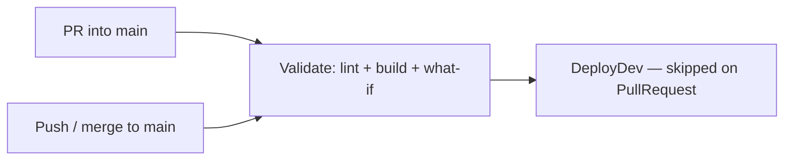

# Day 5 — Azure DevOps CI/CD for Bicep

Commands: [commands.md](commands.md)  
YAML: copy `day-05/samples/azure-pipelines.yml` into `iac-uXX` as `pipelines/azure-pipelines.yml`.  
Service connection `sc-azure-bicep` and variable group `vg-bicep-class` already exist.

Set `resourceGroupName` default to `rg-bicep-uXX`. Never target `rg-bicep-shared`.

---

## Module 5.1 — Azure DevOps pipelines

### Azure DevOps pipelines overview

A pipeline is YAML **in the repo**. A run is a job on a Microsoft-hosted agent (`ubuntu-latest`). The identity that talks to Azure is the **service connection**, not your `az login`.

| Event | What runs |
|-------|-----------|
| Push / merge to `main` | Validate, then **DeployDev** |
| Pull request into `main` | **Validate only** (`DeployDev` skipped) |

That split is CI (every PR) without deploying from the feature branch.

Hands-on: [Pipelines hub](https://dev.azure.com/org-bicep/bicep-aug26/_build).

### YAML pipeline structure

Order in the file: `trigger`, `pr`, `pool`, `parameters`, `variables`, `stages` → `jobs` → `steps`.

```yaml
trigger:
  branches:
    include:
      - main
pr:
  branches:
    include:
      - main

pool:
  vmImage: ubuntu-latest

parameters:
  - name: resourceGroupName
    type: string
    default: rg-bicep-uXX   # change from rg-bicep-demo
```

`variables: - group: vg-bicep-class` attaches the class variable group. Storage-only deploy does not read a password from it today.

Hands-on: `cat pipelines/azure-pipelines.yml`.

### Service Connection concept

```yaml
azureSubscription: sc-azure-bicep
```

That name is an Azure Resource Manager service connection already created in the project. The pipeline uses that identity for `az bicep` / `az deployment`. The connection is federated (no client secret in the YAML). Do **not** create a new connection. First run may ask you to **Permit** the variable group and the connection — permit, do not edit the connection.

### Pipeline stages overview



| Stage | Tasks | When |
|-------|--------|------|
| Validate | `az bicep lint`, `az bicep build`, `az deployment group what-if` with `dev.bicepparam` | Always (PR and `main`) |
| DeployDev | `az deployment group create` with `dev.bicepparam` | `main` only (`condition: ne(Build.Reason, PullRequest)`) |

`DeployDev` `dependsOn` Validate. The pipeline deploys `main.bicep` with `dev.bicepparam` (Day 4 files in `iac-uXX`).

### What-If deployments

`az deployment group what-if` shows Create / Ignore / Modify / Delete **without** changing Azure. There is no saved plan file. The next `az deployment group create` talks to live ARM again. First time this is a taught lab. Run it on the CLI **and** read the pipeline What-If log.

What-If is a preview, not a pixel-perfect contract. Default properties and some policy effects can show as noise. Use it to catch Create / Modify / Delete before DeployDev.

| Result | Meaning |
|--------|---------|
| Ignore | Azure already matches the template |
| Create | Resource would be added |
| Modify | Property change (for example SKU) |
| Delete | Would remove something in complete mode — not this lab |

---

## Lab 1 — CI validation pipeline

Create the pipeline from `day-05/samples/azure-pipelines.yml` (copied to `/pipelines/azure-pipelines.yml` on `iac-uXX`). Set `resourceGroupName` to `rg-bicep-uXX`. Run it. Open **Bicep build**, then **What-If**. Also run What-If on `samples/whatif-storage.bicep`, then delete `stb26uXXq`.

Commands: [commands.md](commands.md) — Lab 1.

---

## Module 5.2 — Continuous deployment for Bicep

### Deployment stages

Validate = CI (compile + What-If). DeployDev = CD to **dev** only (`dev.bicepparam`). No test stage, no prod stage.

### Environment approvals (conceptual)

Azure DevOps Environments can require a person to approve before a stage runs. This pipeline does **not** add a check. Production pattern: an approver for prod — **not configured** in this class. `DeployDev` starts when Validate succeeds.

### Dev environment deployments

`az deployment group create` with `dev.bicepparam`. Account name from Day 4 `main.bicep` (`stb26uXX`). Tags stay `env=dev`.

### Pipeline troubleshooting basics

Red stage → open the **task log** (not only the stage name).

| Symptom | Usual cause |
|---------|-------------|
| Bicep build / lint red | Syntax or analyzer in `main.bicep` |
| What-If red | Service connection RBAC, wrong `resourceGroupName` |
| DeployDev red | Azure (name taken, policy on Day 6). Storage name stays `stb26uXX`; if the name is taken globally, change the class prefix |
| DeployDev skipped | Run reason is PullRequest — expected on a PR |

### Secure deployment considerations

No passwords in YAML (`grep` should find none). Identity is the service connection. `@secure()` stays in Bicep for Day 3 compute. The variable group is where a VM password would live — not used in today’s storage create.

---

## Lab 2 — CI/CD deployment

Let the **main** run finish **DeployDev**. A run from a pull request stops after Validate. Portal + `az storage account list` + `az deployment group show --name main`. Then branch, toggle SKU in `dev.bicepparam`, PR (Validate only), complete, pipeline on `main` (Validate + DeployDev). What-If on the merge should show **Modify** on SKU.

Commands: [commands.md](commands.md) — Lab 2.

No GitHub Actions. No prod stage. No real approval gate.
