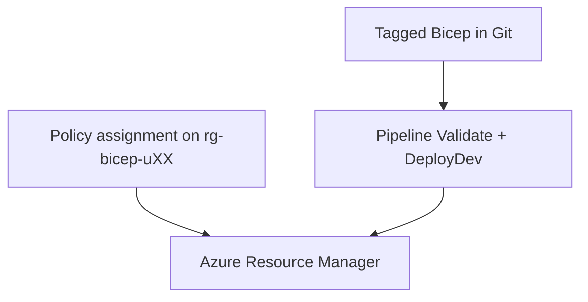

# Day 6 — Governance and capstone

Commands: [commands.md](commands.md)  
Labs: Lab 1 uses `samples/tagged-storage.bicep`. Lab 2 copies `samples/main.bicep`, `dev.bicepparam`, `modules/`, and `pipelines/azure-pipelines.yml` into `iac-uXX`.

Do not deploy a VNet into `rg-bicep-shared`. Do not put the VM password in Git.

---

## Today’s story

All week you built storage, network, compute, Git, and a pipeline. That is how a team ships infrastructure as code.

Real companies add one more rule: **Azure must reject resources that break the rules**, even if someone clicks Create in the Portal or forgets a tag in Bicep. That rule is **Azure Policy**.

Today you will:

1. Learn what a policy definition and a policy assignment are  
2. Assign a built-in policy on **your** resource group in the Portal (twice: once for `env`, once for `owner`)  
3. Prove a bad create is blocked, then deploy a tagged storage account that succeeds  
4. Run a harder end-of-week **capstone**: two storage accounts + a VM on the class subnet, through Git and the pipeline, then a second change and cleanup  

Replace `XX` with your seat. Example: seat `u03` → `bu03@attt21.onmicrosoft.com`, `rg-bicep-u03`, `iac-u03`, `vm-bicep-u03`.

---

## Module 6.1 — Governance basics

### Tagging standards

A **tag** is a name/value label on an Azure resource. Teams use tags for cost reports, ownership, and environment (dev vs test).

In this class every resource you deploy must carry at least:

| Tag | Meaning | Example |
|-----|---------|---------|
| `env` | Environment | `dev` |
| `owner` | Your seat | `u03` (not the letters `XX`) |
| `project` | Class project name | `bicep-training` |

Put tags in the Bicep `tags` object (usually from a parameter). Do not rely on adding tags by hand in the Portal after deploy. Portal can verify tags; Bicep should create them.

Tag **keys are case-sensitive**. `env` and `Env` are different. Policy in this class looks for lowercase `env` and `owner`.

```bicep
param tags object = {
  env: 'dev'
  owner: 'uXX'
  project: 'bicep-training'
}
```

Hands-on later: `grep -n tags` on the Day 6 samples.

### Naming standards

Names stay locked so the class does not collide and so ops can find resources fast.

| Resource | Name pattern |
|----------|----------------|
| Storage (capstone) | `stb26uXXa`, `stb26uXXb` |
| Throwaway Lab 1 storage | `stb26uXXz` (delete when done) |
| VM / NIC / PIP | `vm-bicep-uXX`, `nic-vm-uXX`, `pip-vm-uXX` |
| Class VNet (already exists) | `vnet-bicep-shared` / `snet-app-shared` |

Do not invent a fourth storage naming style for the capstone.

### Enterprise governance overview

Think of three controls on the same resource group:

1. **Bicep** — you declare the right names and tags in code  
2. **Pipeline** — Azure DevOps validates and deploys that code to Dev  
3. **Policy** — Azure Resource Manager blocks creates/updates that miss required tags  



If Bicep forgets `owner`, policy can still deny the deploy. If someone uses the Portal without tags, policy can deny that too. Same rule for every tool.

The Portal is for **checking** results (tags, compliance, VM nic). It is not the place where you define the week’s infrastructure.

### Policy-driven deployments (beginner path)

Azure Policy has three ideas you must separate:

| Word | Plain meaning |
|------|----------------|
| **Definition** | The rule template. Example: “Require a tag on resources.” Microsoft ships many built-in definitions. |
| **Assignment** | The definition turned **on** at a **scope** (subscription, management group, or resource group). Until you assign it, the definition does nothing. |
| **Effect** | What happens when the rule fails. Today we use **Deny** — the create or update is blocked. |

Built-in definition used in this class:

- Display name: **Require a tag on resources**  
- Name (GUID): `871b6d14-10aa-478d-b590-94f262ecfa99`  
- Parameter: `tagName` (which tag key is required)

You will create **two assignments** on `rg-bicep-uXX` only:

1. `tagName` = `env`  
2. `tagName` = `owner`  

Scope must be **your resource group**, not the whole subscription, and not `rg-bicep-shared`. That way a mistake only affects your lab RG.

Policy runs inside ARM. Portal, CLI, Bicep, and the pipeline all hit the same deny.

Bicep can **look up** the built-in definition with `existing`. That does **not** create the assignment. Assignments are done in the Portal (Lab 1) or by the trainer with CLI — not by deploying `policyAssignments` from your student Bicep.

```bicep
resource requireTagOnResources 'Microsoft.Authorization/policyDefinitions@2021-06-01' existing = {
  name: '871b6d14-10aa-478d-b590-94f262ecfa99'
  scope: subscription()
}
```

`scope: subscription()` here means “find this built-in definition at subscription scope.” It does not assign the policy to the subscription.

Day 5 What-If can sometimes show a policy problem before DeployDev. Treat What-If as a helpful check, not a perfect list of every policy message.

### How to assign the policy in Azure Portal

You will do this for real in Lab 1. Read the steps once here, then follow [commands.md](commands.md).

**A. Open Policy and find the definition**

1. Sign in to the Azure Portal as `buXX@attt21.onmicrosoft.com`.  
2. Search for **Policy** and open it.  
3. Under **Authoring**, open **Definitions**.  
4. Search for `Require a tag on resources`.  
5. Open the built-in definition. Read the description. Note the parameter **Tag Name**.

**B. Assign it for `env` on your RG**

1. In Policy, open **Assignments** → **Assign policy** (or from the definition page use **Assign**).  
2. **Scope**: select only `rg-bicep-uXX` (your seat). Remove broader scopes if the picker added the subscription.  
3. **Policy definition**: **Require a tag on resources**.  
4. **Assignment name**: `uXX-require-tag-env` (example `u03-require-tag-env`).  
5. Open **Parameters**. Set **Tag Name** to `env`.  
6. Leave the effect as **Deny** if shown.  
7. **Review + create** → **Create**.

**C. Assign it again for `owner`**

Repeat Assign policy. Same scope `rg-bicep-uXX`. Assignment name `uXX-require-tag-owner`. Parameter **Tag Name** = `owner`.

**D. Confirm**

1. Resource groups → `rg-bicep-uXX` → **Policies** (or Policy → Assignments filtered to your RG).  
2. You should see both assignments.  
3. Open **Compliance** for the RG after you deploy something — compliant resources show the required tags.

If an assignment with the same name already exists from an earlier class setup, open it and confirm scope + `tagName`. Do not assign the same name twice. You may use the existing assignment and still continue the lab.

### Compliance considerations

| Situation | Result |
|-----------|--------|
| Create storage **without** `env` or `owner` | Deny — resource not created |
| Deploy Bicep **with** `env`, `owner`, and `project` | Succeeded |
| Extra tags (for example `workload`) | Allowed — policy only requires the named keys |
| Testing deny on `rg-bicep-shared` | Do **not** — you can break the class network |

After a good deploy, Portal → resource → **Tags** should show your keys. Policy compliance on the RG should move toward compliant for those resources.

---

## Lab 1 — Policy-compliant deployment

**Goal:** You understand definition vs assignment, you assign (or confirm) the two tag policies on your RG, you see a deny, then you deploy a tagged account that succeeds.

You will:

1. Assign or confirm policies in the Portal (steps above)  
2. Optionally try a CLI create **without** tags and see the deny  
3. Deploy `samples/tagged-storage.bicep` with tags  
4. Verify tags and the `policyDefinitionId` output  
5. Delete the throwaway storage account `stb26uXXz`  

Commands: [commands.md](commands.md) — Lab 1.

---

## Module 6.2 — Capstone project

### Capstone story

Your team’s “small app” footprint for Dev is:

- Two storage accounts (app data + logs style), from one module, names from a prefix  
- One Ubuntu VM on the **existing** class app subnet (no new VNet)  
- Required tags on storage, NIC, PIP, and VM  
- Code in Azure Repos `iac-uXX`, feature branch + Pull Request  
- Day 6 pipeline: Validate on PR; DeployDev on `main` (password from a secret, not from Git)  
- A second PR that changes storage SKU and a `workload` tag  
- Delete the VM (and NIC, PIP, OS disk) when you finish so cost stops  

This is harder than Day 5 storage-only: compute and storage live in one `main.bicep`, the pipeline must pass a secure password, and you must prove the NIC sits on `snet-app-shared`.

### Locked architecture

| Piece | Where |
|-------|--------|
| Modular storage | `modules/storage.bicep` called twice |
| Compute module | `modules/compute.bicep` (PIP, NIC, VM + `existing` subnet) |
| Main | `main.bicep` + `dev.bicepparam` |
| Pipeline | `pipelines/azure-pipelines.yml` (Day 6 sample) |
| Storage names | `stb26uXXa`, `stb26uXXb` |
| VM / NIC / PIP | `vm-bicep-uXX`, `nic-vm-uXX`, `pip-vm-uXX` |
| Network | **existing** `vnet-bicep-shared` / `snet-app-shared` only |
| Tags | `env`, `owner`, `project`, plus `workload` for the change request |
| Git | `feature/capstone-tags` then `feature/capstone-sku` |
| Target RG | `rg-bicep-uXX` only |

Password: `@secure()` in Bicep; empty in `dev.bicepparam`; real value on the CLI for local tests and as secret `VM_ADMIN_PASSWORD` on the pipeline (or in `vg-bicep-class` if already present). Never commit the password.

If B-series quota blocks the VM, note it on your sheet, finish storage + Git + pipeline, and tell the trainer. Do not create a second VNet as a workaround.

### Lab 2 — End-to-end project

Copy the Day 6 samples into a clean working tree on `iac-uXX`, replace `XX`, push through a PR, run the pipeline, deploy compute with the same template, complete the second PR, verify in Portal and CLI, then destroy the VM.

Commands: [commands.md](commands.md) — Lab 2.
