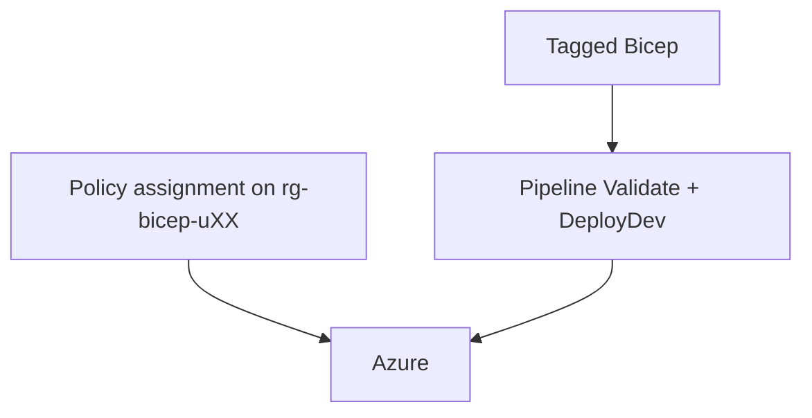

# Day 6 — Governance and capstone

Commands: [commands.md](commands.md)  
Labs: `samples/tagged-storage.bicep` (Lab 1) and `samples/main.bicep` plus `samples/modules/` copied into `iac-uXX` (Lab 2).

Do not deploy a VNet into `rg-bicep-shared`.

---

## Module 6.1 — Governance basics

### Tagging standards

Every resource this course deploys carries `env`, `owner`, and `project=bicep-training`. `owner` is `uXX`. Tags are in the Bicep `tags` object (parameters), not a portal afterthought.

```bicep
param tags object = {
  env: 'dev'
  owner: 'uXX'
  project: 'bicep-training'
}
```

`samples/main.bicep` passes `tags` into the storage module. Hands-on: `grep -n tags day-06/samples/main.bicep day-06/samples/modules/storage.bicep`.

### Naming standards

Locked patterns from the week. Capstone does not invent a fourth required storage name.

| Resource | Name |
|----------|------|
| Storage | `stb26uXXa`, `stb26uXXb` |
| VM / NIC / PIP | `vm-bicep-uXX`, `nic-vm-uXX`, `pip-vm-uXX` |
| Class VNet (existing) | `vnet-bicep-shared` / `snet-app-shared` |

### Enterprise governance overview

Three controls, one resource group:



| Control | What it does |
|---------|----------------|
| Bicep | Declares names and tags |
| Policy | Denies a create/update missing `env` or `owner` |
| Pipeline | Same YAML as Day 5; deploys only `dev.bicepparam` |

Portal is verify, not the source of truth.

### Policy-driven deployments

Policy sits in ARM. A deny assignment blocks Portal, CLI, and Bicep the same way. ARM evaluates **assignments** at create/update. Bicep `existing` on the **definition** is read-only (`subscription()` scope on the definition resource). You do not deploy policy assignments from Bicep. Assignments `require-tag-env` and `require-tag-owner` are already on **your resource group**.

Day 5 What-If can surface a deny before DeployDev. Treat What-If as a safety net, not a pixel-perfect list of every policy effect.

```bicep
resource requireTagOnResources 'Microsoft.Authorization/policyDefinitions@2021-06-01' existing = {
  name: '871b6d14-10aa-478d-b590-94f262ecfa99'
  scope: subscription()
}
```

Built-in definition: **Require a tag on resources** (`871b6d14-10aa-478d-b590-94f262ecfa99`). `output policyDefinitionId` on the tagged-storage sample proves the lookup resolved. It does not create the assignment.

### Compliance considerations

Missing `env` or `owner` → deny. Tagged template → Succeeded. Do not strip tags to “test” deny on the class VNet. Extra tags are allowed; the assignment requires the named keys to exist.

---

## Lab 1 — Policy-compliant deployment

Read the `existing` definition in `samples/tagged-storage.bicep`, `az policy definition show`, list assignments on `rg-bicep-uXX`, deploy the tagged account, verify tags, then delete `stb26uXXz`.

Commands: [commands.md](commands.md) — Lab 1.

---

## Lab 2 — End-to-end capstone

Copy `day-06/samples/main.bicep`, `dev.bicepparam`, and `modules/` into `iac-uXX`. Same Day 5 pipeline. Optional VM from `day-03/samples/compute.bicep`.

| Piece | Where |
|-------|--------|
| Modular Bicep | `samples/modules/storage.bicep` |
| Storage | `rg-bicep-uXX`, `stb26uXXa` / `b` |
| Network | **existing** class VNet (no second VNet in shared RG) |
| Compute | optional VM in your RG if quota allows |
| Tags and naming | `dev.bicepparam` |
| Git | branch `feature/capstone-tags`, PR, `main` |
| Pipeline | Day 5 YAML, `resourceGroupName=rg-bicep-uXX` |
| Portal | resource group `rg-bicep-uXX` |
| Second PR | toggle `storageSku`, pipeline again |

Password on the CLI for compute; not in YAML; not in git.

Commands: [commands.md](commands.md) — Lab 2.
